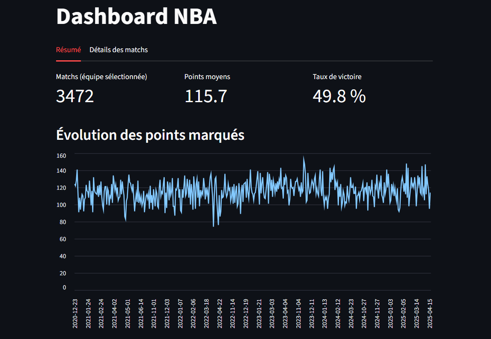

🏀 NBA Data Pipeline & Analytics Dashboard

Un pipeline complet : ingestion → validation → transformation → analyse → dashboard Streamlit.

Introduction

Ce projet construit un pipeline de données complet à partir de l’API BallDontLie pour analyser les performances NBA entre 2020 et 2024.

[Voir le dashboard Streamlit](https://nba-data-pipeline-4pr.streamlit.app/)

Il couvre :

✅ Ingestion des données (API → JSON)
✅ Validation stricte des données avec Pydantic
✅ Gestion des erreurs & rapports qualité
✅ Transformation & nettoyage → Parquet
✅ Agrégation d'indicateurs clés (attaque, défense, victoires)
✅ Dashboard interactif Streamlit
➡️ Le tout en suivant une logique Data Engineering propre et modulaire.

📂 Architecture du projet
```
NBA-Data-Pipeline/
│
├── data/
│   ├── raw/            # JSON téléchargés depuis l’API
│   ├── validated/      # données validées via Pydantic
│   ├── errors/         # logs d’erreurs de validation
│   ├── clean/          # fichiers Parquet finaux
│   └── indicators/     # indicateurs globaux générés
│
├── models/
│   └── schema.py       # modèles Pydantic (Game, TeamInfo)
│
├── scripts/
│   ├── ingest.py       # ingestion API → raw JSON
│   ├── validate.py     # validation Pydantic → erreurs / validated
│   └── clean.py        # transformation JSON → Parquet
│
├── dashboard/
│   └── app.py          # application Streamlit
│
└── README.md
```

 Pipeline complet
1️- Ingestion (scripts/ingest.py)

Appelle l’API BallDontLie.

Gère la pagination via cursor.

Gère les erreurs 429 Too Many Requests.

Sauvegarde un fichier JSON par saison (games_2023.json, etc.)

2️- Validation & Qualité (scripts/validate.py)

Utilise Pydantic v2 pour :

typer strictement tous les champs

contrôler que l’équipe domicile ≠ équipe extérieure

détecter les anomalies de schéma

générer des fichiers :

data/validated/games_2020_validated.json
data/errors/games_2020_errors.json


Un rapport qualité comptabilise :

invalid_schema

same_team

autres erreurs potentielles

3️- Transformation → Parquet (scripts/clean.py)

Chaque ligne JSON est :

aplatit (flatten)

transformée en ligne homogène

enregistrée en Parquet, format optimal pour l’analyse :

data/clean/games_2023_clean.parquet

4️- Analyse et indicateurs (scripts/analyze.py)

Calcul des métriques :

meilleures attaques NBA

meilleures défenses

classement des victoires

moyenne des points par équipe

Résultat dans :

data/indicators/indicators.json

5️- Dashboard Streamlit (hello.py)

Fonctionnalités :

🔹 Filtre par saison
🔹 Filtre par équipe
🔹 KPIs dynamiques :
   → match filtrés
   → points moyens
   → taux de victoire
🔹 Graphique interactif de l’évolution des points
🔹 Tableau des matchs filtrés

🖼️ Aperçu du dashboard



st.title("NBA Dashboard")
st.sidebar.multiselect("Saison", ...)
st.sidebar.selectbox("Équipe", ...)
st.metric(...)
st.line_chart(...)

🛠️ Installation
1️⃣ Créer un environnement
python -m venv venv
source venv/bin/activate  # ou venv\Scripts\activate sous Windows

2️⃣ Installer les dépendances
pip install -r requirements.txt

3️⃣ Lancer le dashboard
streamlit run dashboard/app.py

📎 Technologies utilisées
Tech	Rôle
Python 3.11+	Langage principal
Pydantic v2	Validation stricte du schéma
Pandas	Manipulation des DataFrames
Parquet / PyArrow	Format colonne optimisé
Streamlit	Front-end du dashboard
BallDontLie API	Source de données NBA
🎯 Objectifs pédagogiques atteints

✔ Compréhension d’un pipeline Data Engineering complet
✔ API → JSON → Validation → Nettoyage → Parquet
✔ Modèles Pydantic avancés (types stricts, validators)
✔ Visualisation dynamique avec Streamlit
✔ Agrégation de métriques pertinentes pour la performance NBA

📬 Auteur

Klein
Étudiant en Data Science & IA

Projet GitHub — NBA Data Pipeline


